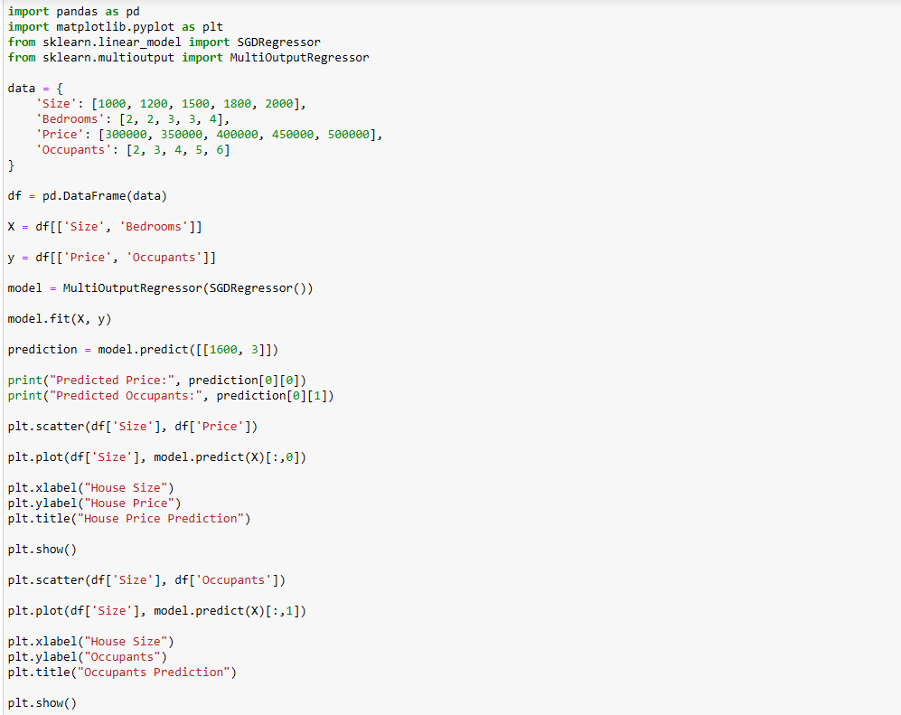
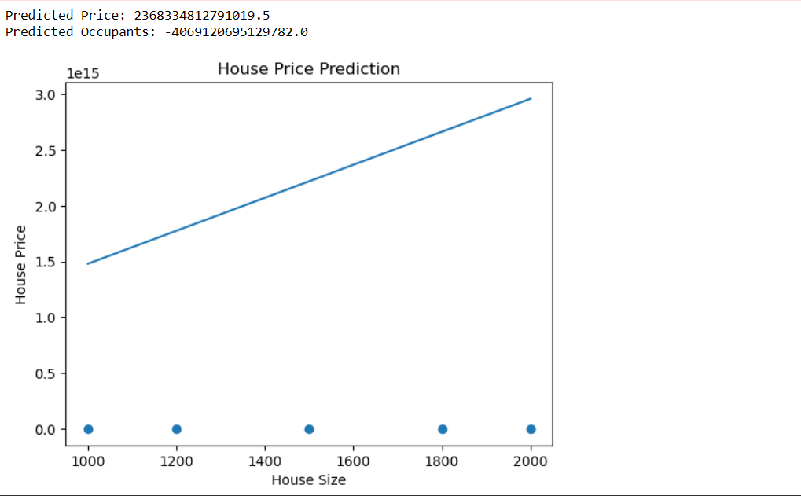
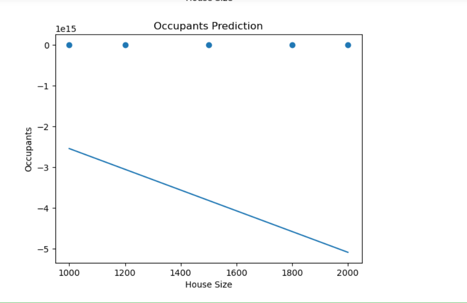

# SGD-Regressor-for-Multivariate-Linear-Regression

## AIM:
To write a program to predict the price of the house and number of occupants in the house with SGD regressor.

## Equipments Required:
1. Hardware – PCs
2. Anaconda – Python 3.7 Installation / Jupyter notebook

## Algorithm

1. Import Libraries
Import required Python libraries: numpy, pandas, sklearn.

2. Load Dataset
Load or create a dataset with features (e.g., area, number of rooms, location index).

Include target variables (house price, number of occupants).

3. Preprocess Data
Handle missing values if present.

Scale features using StandardScaler to speed up convergence.

4. Split Dataset
Use train_test_split to split data into training and testing sets.

5. Train Model with SGD Regressor
Initialize SGDRegressor with a learning rate and max iterations.

Use MultiOutputRegressor for predicting multiple outputs.

Train model using the training set.

6. Make Predictions
Predict house price and number of occupants for the test set.

7. Evaluate Model
Use metrics such as r2_score and mean_squared_error to check performance.

8. Display Results
Print actual vs predicted values for better understanding.

## Program:
```
/*
Program to implement the multivariate linear regression model for predicting the price of the house and number of occupants in the house with SGD regressor.

# Ex:No 4
#Manual Implementation using Numpy
import pandas as pd
import matplotlib.pyplot as plt
from sklearn.linear_model import SGDRegressor
from sklearn.multioutput import MultiOutputRegressor

data = {
    'Size': [1000, 1200, 1500, 1800, 2000],
    'Bedrooms': [2, 2, 3, 3, 4],
    'Price': [300000, 350000, 400000, 450000, 500000],
    'Occupants': [2, 3, 4, 5, 6]
}

df = pd.DataFrame(data)

X = df[['Size', 'Bedrooms']]

y = df[['Price', 'Occupants']]

model = MultiOutputRegressor(SGDRegressor())

model.fit(X, y)

prediction = model.predict([[1600, 3]])

print("Predicted Price:", prediction[0][0])
print("Predicted Occupants:", prediction[0][1])

plt.scatter(df['Size'], df['Price'])

plt.plot(df['Size'], model.predict(X)[:,0])

plt.xlabel("House Size")
plt.ylabel("House Price")
plt.title("House Price Prediction")

plt.show()

plt.scatter(df['Size'], df['Occupants'])

plt.plot(df['Size'], model.predict(X)[:,1])

plt.xlabel("House Size")
plt.ylabel("Occupants")
plt.title("Occupants Prediction")

plt.show()

Developed by: Swathi P N
RegisterNumber:  212225230279
*/
```

## Output:







## Result:
Thus the program to implement the multivariate linear regression model for predicting the price of the house and number of occupants in the house with SGD regressor is written and verified using python programming.
